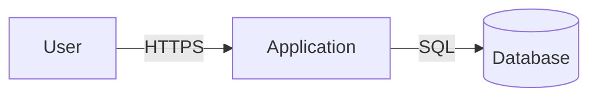

# Threat Model Generator

This skill analyzes the project in the current working directory and produces a
`threat_model.md` file at the project root containing a thorough threat model
using the **STRIDE** methodology (Spoofing, Tampering, Repudiation,
Information Disclosure, Denial of Service, Elevation of Privilege).

## When to use this skill

Use this skill whenever the user asks for any of the following:

- "Generate a threat model"
- "Create a threat_model.md"
- "Build / write / update a threat model for this project"
- "Run a STRIDE analysis on this repo"

## How to perform the analysis

Follow these steps in order. Do not skip steps. If information is missing,
explicitly note assumptions in the output rather than fabricating details.

### 1. Discover the project

Inspect the current working directory to understand what the project is.
Gather as much of the following as possible before writing the model:

1. **Project metadata** — Read `README.md`, `README.rst`, `package.json`,
   `pyproject.toml`, `setup.py`, `Cargo.toml`, `go.mod`, `pom.xml`,
   `build.gradle`, `*.csproj`, `Gemfile`, `composer.json`, etc., to identify:
   - Project name, description, purpose
   - Primary language(s) and frameworks
   - Runtime / deployment target (CLI, web service, library, mobile app, etc.)
2. **Dependencies** — List direct dependencies from manifest files. Flag any
   that are commonly security-sensitive (auth, crypto, networking,
   serialization, template engines, database drivers).
3. **Entry points & interfaces** — Identify how external actors interact with
   the system. Look for:
   - HTTP/gRPC/WebSocket handlers, routes, controllers
   - CLI argument parsers and `main` functions
   - Message queue consumers, event handlers, webhooks
   - File / upload handlers
   - Authentication and authorization code
4. **Data stores & external services** — Look for database connection strings,
   ORM models, cloud SDK usage (AWS, GCP, Azure), third-party API clients,
   secret management code.
5. **Trust boundaries** — Identify where data crosses between zones of
   different trust (e.g., internet → server, server → database, user → admin,
   tenant → tenant, host → container).
6. **Existing security controls** — Note presence of:
   - Authentication / authorization libraries
   - Input validation / sanitization
   - CSRF, CORS, security headers
   - Encryption at rest / in transit
   - Logging, auditing, rate limiting
   - Dependency scanning, SAST, secret scanning configs (Dependabot, CodeQL,
     `.github/workflows/*`)

Prefer reading actual files over guessing. If the repo is large, sample
representative files from each major directory.

### 2. Build the threat model

For each identified component, asset, and trust boundary, enumerate threats
using STRIDE. For each threat, capture:

| Field | Description |
|---|---|
| ID | Stable identifier (e.g., `T-001`) |
| Category | STRIDE category |
| Component | Affected component / asset |
| Description | What could go wrong and how |
| Impact | C/I/A impact and severity (Low/Med/High/Critical) |
| Likelihood | Low / Medium / High, with brief justification |
| Existing mitigations | What the codebase already does |
| Recommended mitigations | Concrete, actionable next steps (reference specific files/functions where possible) |

Be specific to **this** project. Avoid generic boilerplate threats that do not
apply. If the project is a pure library with no network surface, do not invent
HTTP threats.

### 3. Produce `threat_model.md`

Write the output to a file named `threat_model.md` at the project root,
**overwriting** any existing file with that name. Use the following structure:

```markdown
# Threat Model: <Project Name>

> Generated by the `threat-model-generator` Copilot CLI plugin on <YYYY-MM-DD>.
> This document is a starting point for security review, not a substitute for
> one. Review and refine with subject-matter experts.

## 1. System Overview
Short description of the project, its purpose, primary users, and deployment
model.

## 2. Architecture & Data Flow
- Components (with file/directory references)
- External dependencies and services
- Data flow summary
- Mermaid diagram of the system and trust boundaries



## 3. Assets
Bulleted list of assets worth protecting (user data, credentials, signing
keys, intellectual property, availability, etc.) with sensitivity ratings.

## 4. Trust Boundaries
Numbered list of trust boundaries identified in the system.

## 5. Threats (STRIDE)
One subsection per STRIDE category. Within each, a table of threats using the
fields defined above.

### 5.1 Spoofing
### 5.2 Tampering
### 5.3 Repudiation
### 5.4 Information Disclosure
### 5.5 Denial of Service
### 5.6 Elevation of Privilege

## 6. Summary of Recommendations
A prioritized, deduplicated list of recommended mitigations, grouped by
severity. Each item should link back to the threat ID(s) it addresses.

## 7. Assumptions & Out of Scope
Explicit list of assumptions made during analysis and items that were not
analyzed (and why).

## 8. References
- Links to relevant files in the repository
- OWASP, CWE, or other external references where appropriate
```

### 4. Confirm and report

After writing `threat_model.md`:

1. Briefly summarize in chat what was generated (number of threats by
   category, top 3 recommendations).
2. Tell the user the file path (`./threat_model.md`).
3. Suggest next steps: review with the team, file issues for High/Critical
   recommendations, re-run the skill after significant architectural changes.

## Quality guidelines

- **Be evidence-based.** Cite specific files, functions, or config lines when
  describing components and threats.
- **Be actionable.** Recommendations should be concrete (e.g., "Add `helmet`
  middleware in `src/server.ts`") rather than vague ("Improve security
  headers").
- **Be honest about limits.** If you could not analyze part of the system,
  list it under "Assumptions & Out of Scope".
- **Do not invent vulnerabilities.** Only list threats that plausibly apply
  given the code you actually inspected.
- **Do not modify other files.** This skill only writes `threat_model.md`.
